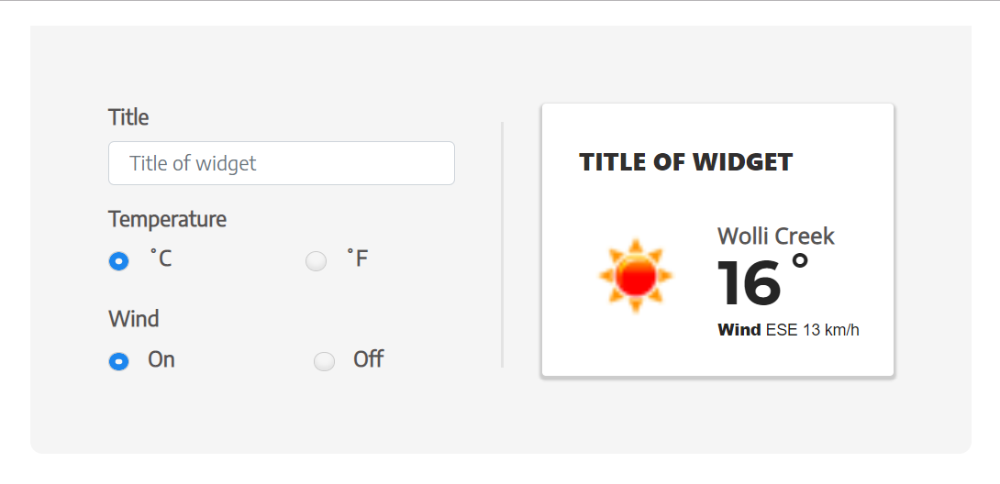

# WeatherWidgetAngular

This project was generated with [Angular CLI](https://github.com/angular/angular-cli) version 6.0.8.

Weather Application Widget – Instrcutions

1.	Source code for the solution described above.
https://github.com/nisarzahid/weather-widget-angular6.git

2.	Setup/installation instructions

This application is build using angular 6. You need to have following installations:

•	Node.js and npm

•	Angular-cli (latest)

•	After cloning the source code from git. Move inside the root directory (where package.json exist) and run npm install.

•	Run ng serve inside the root folder where package,json resides.

•	Open the browser http://localhost:4200/ 

•	You will see the following interface

 

3.	Description:

Angular is widely used frontend javascript framework, I have the expertise in that.
Application takes the user current coordinates from the browser api navigator.geolocations and then using those coordinates it calls the openweathermap api to fetch the current weather conditions and display it on widget screen. You can edit the Title of the widget as well re-form the weather info by changing Temperature format and wind condition.
	

Application source code consist of following parts:

•	AppModule 
This consist of root component app.component which is bootstrap by default in browser when application runs.

•	WeatherWidgetModule
This is standalone weather widget module which can be exported and imported anywhere to this application and also to externally. It consist of following parts:

•	WeatherWdigetComponent
This is the html/css and typescript file of complete widget screen you are seeing on screen.  It will be rendered anywhere if you add this component selector. Like I did in App.component. 
<app-weather-widget></app-weather-widget>

•	Weather.Service
This is http service to make http call to OpenWeatherMap api. The service is injected into component using dependency injection.

•	Environment variables
These are inside the environments folder at the root. It contains environment flags for dev and production for following variable values

•	production: sets to true when build using –prod command

•	appId: OpenWeatherMap api provided app key id.

•	baseUrl: Base url to make http call for openweathermap ('http://api.openweathermap.org/data/2.5/')

•	units: default unit for temperature – currently sets as imperail
 
4.	Assumptions

•	Application assume you have setup for Angular 6 and Node.js on you machine.

•	Application assumes that browser have allowed to get the user location.

•	Environment variables are used to set the OpenWeatherMap app key id and baseUrl. Change the values appropriately.

## Development server

Run `ng serve` for a dev server. Navigate to `http://localhost:4200/`. The app will automatically reload if you change any of the source files.

## Code scaffolding

Run `ng generate component component-name` to generate a new component. You can also use `ng generate directive|pipe|service|class|guard|interface|enum|module`.

## Build

Run `ng build` to build the project. The build artifacts will be stored in the `dist/` directory. Use the `--prod` flag for a production build.

## Running unit tests

Run `ng test` to execute the unit tests via [Karma](https://karma-runner.github.io).

## Running end-to-end tests

Run `ng e2e` to execute the end-to-end tests via [Protractor](http://www.protractortest.org/).

## Further help

To get more help on the Angular CLI use `ng help` or go check out the [Angular CLI README](https://github.com/angular/angular-cli/blob/master/README.md).
